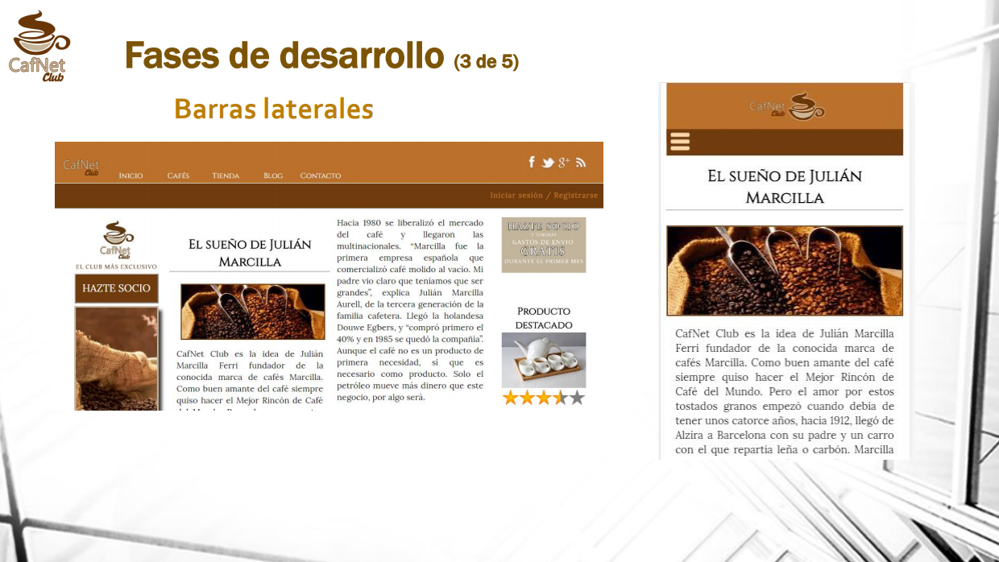

# cafeNet

👩‍🎓  Website redesign from scratch 

    📆 2016

    📚 Web interface design course's project

    🔨 HTML5 & CSS3

🌟 So many things I've learn the past years. But I'm a little proud of this. Now, I will acomplish this in a total different way, but this responsive design without CSS grid or jsvascript it's was a challenging way to improve my skills. 

You can look it out here :point_down:

- [cafenet.com](https://dianait.github.io/cafeNet/)

- :chart_with_upwards_trend: [Power point's presentation](https://drive.google.com/file/d/19meHdLxg6q7jIb9CdReCCH3-tj_Ejw29/view?usp=sharing) 🇪🇸

---

⌨️ with ❤️ by Diana